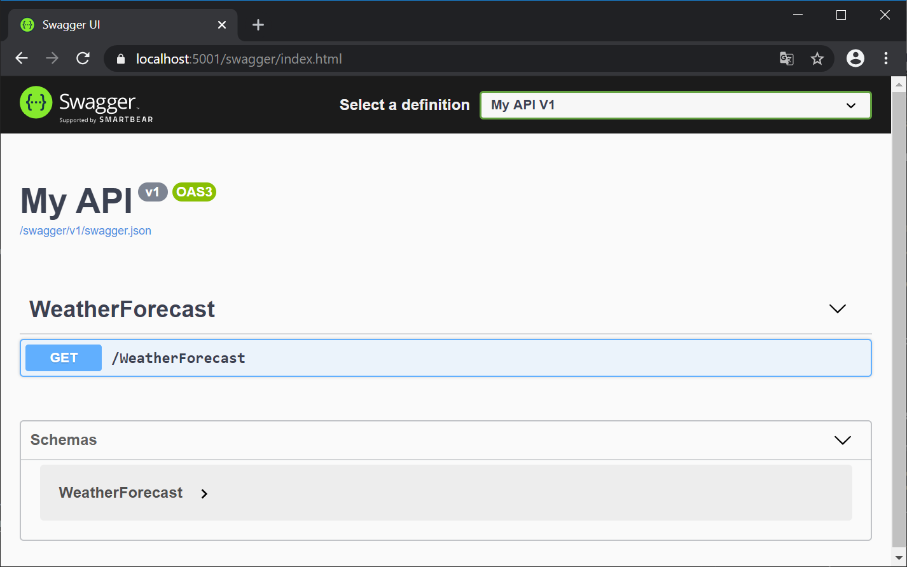
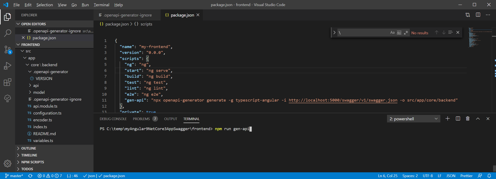
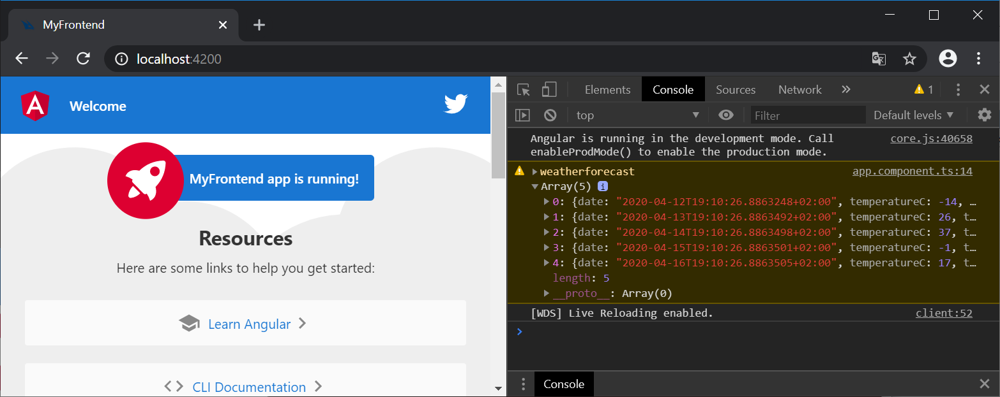

# Auto-Generate Backend-Services in Angular 9 for .NET Core 3.1 Backend

## Goal

We want to generate TypeScript classes in Angular frontend to simplify backend access. To achieve this, we have to add OpenApi (Swagger/Swashbuckle) to your .NET Core backend.

## Install Swagger/OpenApi in new WebAPI Project

### Create new .NET WebAPI project

Use your own .NET Core 3.1 WebApi backend.

Alternatively you can clone my sample from here: <https://github.com/boeschenstein/angular9-dotnetcore3>

> If you are new to web development: open cmd in the folder `\frontend` and enter "npm i" to install the node modules.

### Add Swashbuckle to your .NET Core backend

Open project in Visual Studio.
Open Package Manager Console (Tools -> Nuget Package Manager -> Package Manager Console).

Install Swashbuckle:

```powershell
Install-Package Swashbuckle.AspNetCore
```

### Configure Swagger/OpenApi

Configure Swagger in `Startup.cs`

``` c#
using Microsoft.OpenApi.Models;
```

Register swagger generator (simple):

``` c#
public void ConfigureServices(IServiceCollection services)
{
    ...
    services.AddControllers(); // already there

    // Register the Swagger generator, defining 1 or more Swagger documents
    services.AddSwaggerGen(c =>
    {
        c.SwaggerDoc("v1", new OpenApiInfo { Title = "My API", Version = "v1" });
    });
}
```

<details>
  <summary>Optional: extended version with more details</summary>

``` c#
// Register the Swagger generator, defining 1 or more Swagger documents
services.AddSwaggerGen(c =>
{
    c.SwaggerDoc("v1", new OpenApiInfo
    {
        Version = "v1",
        Title = "ToDo API",
        Description = "A simple example ASP.NET Core Web API",
        TermsOfService = new Uri("https://boeschenstein.net/terms"),
        Contact = new OpenApiContact
        {
            Name = "Patrik Böschenstein",
            Email = string.Empty,
            Url = new Uri("https://twitter.com/patrikbo"),
        },
        License = new OpenApiLicense
        {
            Name = "Use under LICX",
            Url = new Uri("https://boeschenstein.net/license"),
        }
    });
});
```

</details>

Activate swagger

```c#
// Enable middleware to serve generated Swagger as a JSON endpoint.
app.UseSwagger();

// Enable middleware to serve swagger-ui (HTML, JS, CSS, etc.),
// specifying the Swagger JSON endpoint.
app.UseSwaggerUI(c =>
{
    c.SwaggerEndpoint("/swagger/v1/swagger.json", "My API V1");
});
```

<details>
  <summary>Complete code of Configure(). I suggest use Swagger in development mode only</summary>

``` c#
public void Configure(IApplicationBuilder app, IWebHostEnvironment env)
{
    if (env.IsDevelopment())
    {
        app.UseDeveloperExceptionPage();

        // Enable middleware to serve generated Swagger as a JSON endpoint.
        app.UseSwagger();

        // Enable middleware to serve swagger-ui (HTML, JS, CSS, etc.),
        // specifying the Swagger JSON endpoint.
        app.UseSwaggerUI(c =>
        {
            c.SwaggerEndpoint("/swagger/v1/swagger.json", "My API V1");
        });
    }

    app.UseHttpsRedirection();

    app.UseRouting();
    // activate cors here: app.UseCors(...): see

    app.UseAuthorization();

    app.UseEndpoints(endpoints =>
    {
        endpoints.MapControllers();
    });
}
```

</details>

Start the backend application
Open swagger endpoint of your backend (you may have a different port)

``` html
https://localhost:5001/swagger
```

### Check the swagger document and API

Your swagger endpoint should look like this. Please note that your WebApi endpoints have been discovered and presented in the GUI:



Execute your endpoints in Swagger: In my case, try WeatherForecast api: "Get", "Try it out", "Execute": You should see the data from the API.

## Add OpenApi to Angular 9

### Install OpenApi Generator

Add the OpenApi generator to your project:

``` cmd
npm install @openapitools/openapi-generator-cli --save-dev
```

If you don't have it yet, install Java for openapi-generator: <https://java.com/download/>

### OpenApi Generator

#### Some information before we generate the code

- According my `\backend\Properties\launchSettings.json`, the endpoint is available by https and http. To avoid issues with https, I decide to use http for generating my the ts files

``` json
...
"MyBackend": {
    "commandName": "Project",
    "launchBrowser": true,
    "launchUrl": "weatherforecast",
    "environmentVariables": {
    "ASPNETCORE_ENVIRONMENT": "Development"
    },
    "applicationUrl": "https://localhost:5001;http://localhost:5000"
}
...
```

- I decided to create the source code here in this frontend folder: `frontend\src\app\core\backend\`
- npx is a tool to start applications from `\nodes_module` folder. It is needed, because the generator is installed locally. This is preferred almost for all tools. In this way, you can have different versions of the tools in different applications.

``` cmd
rem Start the backend to read all information out of it. Then start the OpenApi generator:

npx openapi-generator generate -g typescript-angular -i http://localhost:5000/swagger/v1/swagger.json -o src\app\core\backend
```

#### Tweak the generator config

The generator is generating the source code and also the configuration to create a node module (this is another approach: see links). To avoid this additional files, edit this file: `frontend\src\app\core\backend\api\.openapi-generator-ignore`

> Any npm related files are Unix file types (LF line feeds instead of Windows CRLF). You have to use notepad++ or VS Code to edit it (older notepad versions might make such files unusable)

Tweak the file by adding the following at the lower end of the file: (.openapi-generator cannot be suppressed here)

``` json
*.sh
*.md
.gitignore
```

Now delete all other files (beside `frontend\src\app\core\backend\api\.openapi-generator-ignore`) and run the generator again.

If you are using my project template, you'll get the following folder structure in `\frontend\src\app\core\backend\`:

``` cmd
|-- .openapi-generator
    |-- VERSION
|-- api
    |-- api.ts
    |-- weatherForecast.service.ts
|-- model
    |-- models.ts
    |-- weatherForecast.ts
|-- .openapi-generator-ignore
|-- api.module.ts
|-- configuration.ts
|-- index.ts
|-- encoder.ts
|-- README.md
|-- variables.ts
```

## Create new npm command

Edit `frontend\package.json` in VS Code. Add the following line to the "scripts" section (use unix style folder separator / or duplicate \ to escape it in json):

``` json
"gen-api": "npx openapi-generator generate -g typescript-angular -i http://localhost:5000/swagger/v1/swagger.json -o src/app/core/backend"
```

From now on, you can easily regenerate your code in cmd, whenever your WebApi (backend) did change:

``` cmd
REM open cmd or VS Code Terminal in `\frontend` and start this:

npm run gen-api
```

That's pretty neat I think.



On this picture you see

- How the new Script line looks like
- I'm using the terminal within VS Code (press Shift Control ¨ to open it)

## Use the new Services

If you are using my template, you change the existing call of the backend (WebApi):

``` typescript
  constructor(http: HttpClient) {
    http.get<any[]>('https://localhost:5001/weatherforecast').subscribe(result => {
      console.warn("weatherforecast", result);
    }, error => console.error(error));
  }
```

To make use of the new/generated service:

``` typescript
  constructor(service: WeatherForecastService) {
    service.weatherForecastGet().subscribe(result => {
      console.warn('weatherforecast', result);
    }, error => console.error(error));
  }
```

If you hover over the result variable, you'll realize that this is actually strictly typed "WeatherForecast[]"!

Before we can actually test the new service, we have to configure the URL.

Add API_BASE_PATH to your  your `src/environments/*.ts`:

``` typescript
export const environment = {
  production: false,
  API_BASE_PATH: 'https://localhost:5001'
};
```

In the `src/app/app.module.ts`, add the following imports and providers:

```typescript
import { BASE_PATH } from '';
import { environment } from '../environments/environment';

providers: [{ provide: BASE_PATH, useValue: environment.API_BASE_PATH }],
```  

<details>
  <summary>See the complete code of AppModule (app.module.ts) here</summary>

```typescript
import { BrowserModule } from '@angular/platform-browser';
import { NgModule } from '@angular/core';
import { AppRoutingModule } from './app-routing.module';
import { AppComponent } from './app.component';
import { HttpClientModule } from '@angular/common/http';
import { BASE_PATH } from './core/backend';
import { environment } from 'src/environments/environment';

@NgModule({
  declarations: [
    AppComponent
  ],
  imports: [
    BrowserModule,
    AppRoutingModule,
    HttpClientModule
  ],
  providers: [{ provide: BASE_PATH, useValue: environment.API_BASE_PATH }],
  bootstrap: [AppComponent]
})
export class AppModule { }
```  

</details>

## Check the application

1. Start your new Backend
2. Start your new Frontend (ng serve -o int the folder `\frontend`)
3. Check Console Output: you should see an array of data:



If you can see the array, you just created your first business application in Angular 9 and .NET core 3.1 and access backend WebApi using Swagger Generator. Congratulations! Please let me know on twitter  [@patrikbo](https://twitter.com/patrikbo). Thank you!

### Whats next

## Additional Information

### Links

- ASP.NET WebApi: <https://docs.microsoft.com/en-us/aspnet/core/tutorials/first-web-api>
- Getting started with Swashbuckle: <https://docs.microsoft.com/en-us/aspnet/core/tutorials/getting-started-with-swashbuckle>
- Swashbuckle: <https://github.com/domaindrivendev/Swashbuckle.AspNetCore>
- OpenApi Generator: <https://github.com/OpenAPITools/openapi-generator>
- OpenApi Generator Fork: <https://openapi-generator.tech/>
- Swagger UI: <https://github.com/swagger-api/swagger-ui>
- Swagger: <https://swagger.io/specification/>
- Angular: <https://angular.io/>
- CORS: <https://docs.microsoft.com/en-us/aspnet/core/security/cors>
- Other approach: create an install package instead of source code: <https://dotnetthoughts.net/how-to-generate-angular-code-from-openapi-specifications/>

### Current Versions

- Visual Studio 2019 16.5.3
- .NET core 3.1
- npm 6.14.4
- node 12.16.1
- Angular CLI 9.1
- SwashBuckle 5.3.1
